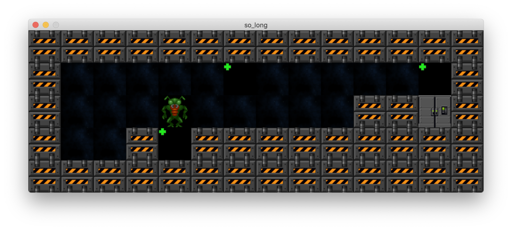
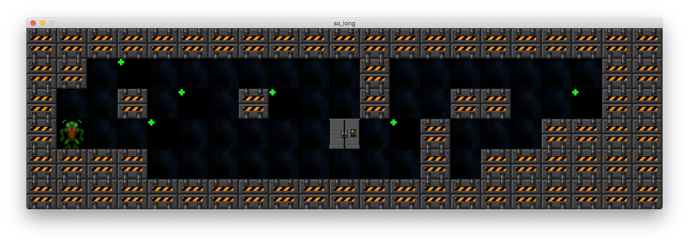

# So_Long...

**So_Long...** projesi, Minilibx kütüphanesi kullanılarak geliştirilen bir 2D oyundur. Bu proje, basit bir 2D oyun geliştirme sürecini ve Minilibx kütüphanesinin kullanımını öğrenmek için ideal bir örnektir.

## Özellikler

- **2D Grafikler:** Minilibx kütüphanesi kullanılarak oluşturulmuş 2D grafiklerle donatılmış bir oyun.
- **Etkileşimli Oynanış:** Kullanıcı etkileşimleri ve oyun mekaniği için temel işlevler.
- **Harita Desteği:** Farklı haritalar ile oynanabilirlik.

## Makefile Kuralları

| Kural         | Açıklama                                           |
|:--------------|:---------------------------------------------------|
| `make`        | Programı derler.                                  |
| `make clean`  | Derleme objelerini temizler.                      |
| `make fclean` | `clean` kuralını uygular ve çalıştırılabilir programı siler. |
| `make re`     | `fclean` kuralını uygular ve programı tekrar derler. |

## Çalıştırma

Öncelikle, programı derlemek için aşağıdaki komutu çalıştırın:
`make`

Daha sonra, maps klasörü içerisinden bir harita seçip programı şu şekilde çalıştırabilirsiniz:

`./so_long map1.ber`
Bu komut, map1.ber adlı harita dosyasını kullanarak oyunu başlatacaktır.

## Kullanım ve Oynanış

- **Harita Dosyası:** Oyun, `.ber` uzantılı harita dosyalarını kullanır. Bu dosyalar, oyunun oyun alanını tanımlar ve çeşitli oyun öğelerini içerir.

- **Kontroller:** Oyunun temel kontrolleri klavye ile sağlanmaktadır.

## Geliştirici Notları

- **Minilibx Kütüphanesi:** Minilibx, basit grafik işlemleri ve pencere yönetimi sağlar. Oyun geliştirme sürecinde bu kütüphanenin kullanımı, grafik tabanlı uygulamalar için iyi bir başlangıçtır.

- **Kod Standartları:** Proje, Norminette kurallarına uygun olarak yazılmıştır. Bu kurallar, kodun okunabilirliğini ve kalitesini artırmayı hedefler.

## Ekran Görüntüleri

Aşağıda oyunun ekran görüntüsünü görebilirsiniz:

